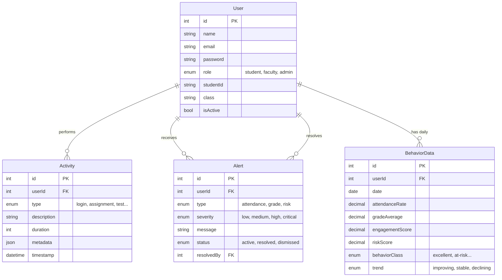

# System Architecture & Design

## 1. Tech Stack & Justification

The **Smart Student Behavior Analytics** system is built using a modern, scalable, and robust technology stack designed for real-time data processing and interactive analytics.

### Selected Stack: PERN/MERN Hybrid (MySQL adaptation)
**Backend:** Node.js + Express.js
**Frontend:** React (Vite) + Tailwind CSS
**Database:** MySQL with Sequelize ORM
**Data Science:** Python (integrated via child processes or microservice)

### Justification

*   **Node.js & Express:** Provides a lightweight, non-blocking I/O model ideal for handling concurrent API requests and real-time data ingestion from student activities.
*   **React (Vite):** Ensures a fast, responsive user interface with component reuse. Vite offers superior build performance over CRA.
*   **MySQL & Sequelize:**
    *   **Structured Data:** Student records, grades, and attendance are highly structured and relational, making a SQL database more suitable than NoSQL (MongoDB).
    *   **Sequelize ORM:** Simplifies complex joins (e.g., fetching a student's alerts, activities, and behavior metrics in one go) and handles schema migrations efficiently.
*   **Tailwind CSS:** Enables rapid UI development with a utility-first approach, ensuring a consistent and modern design system without writing custom CSS files.
*   **Python:** The industry standard for Machine Learning. Used here to run the behavior classification models (Random Forest/XGBoost) on the data collected by the Node.js backend.

---

## 2. System Flow Diagram

The following diagram illustrates how data flows from the client to the database and how the ML component interacts with the system.

```mermaid
graph TD
    User[User (Student/Faculty)] -->|HTTPS| Client[React Frontend]
    Client -->|REST API| LoadBalancer[Nginx / API Gateway]
    LoadBalancer --> Server[Node.js Express Server]
    
    subgraph Backend Services
        Server --> Auth[Auth Middleware (JWT)]
        Server --> ActivityCtrl[Activity Controller]
        Server --> AnalyticsCtrl[Analytics Controller]
    end

    subgraph Data Layer
        ActivityCtrl -->|Write| DB[(MySQL Database)]
        AnalyticsCtrl -->|Read/Write| DB
    end

    subgraph ML Engine
        Server -->|Trigger Analysis| MLScript[Python Behavior Classifier]
        MLScript -->|Fetch Data| DB
        MLScript -->|Update Scores| DB
    end

    AnalyticsCtrl -->|JSON Response| Client
```

---

## 3. Database Schema & Entity Design

The database is normalized to ensure data integrity.

### Entity Relationships (ER) Diagram



---

## 4. UI/UX Wireframes & Theme

### Design Philosophy
*   **Modern & Clean:** Using plenty of whitespace, rounded corners (MD/LG), and a card-based layout.
*   **Data-First:** Dashboards prioritize visualizations (Charts) over tables.
*   **Accessible:** High contrast text and distinguishable colors for status indicators.

### Color Palette (Tailwind)

| Color Name | Hex Code | Usage |
|:---|:---|:---|
| **Primary** | `#4F46E5` (Indigo-600) | Main buttons, active states, branding |
| **Secondary** | `#64748B` (Slate-500) | Secondary text, inactive icons |
| **Success** | `#10B981` (Emerald-500) | High scores, "Excellent" behavior |
| **Warning** | `#F59E0B` (Amber-500) | "Average" behavior, medium risks |
| **Danger** | `#EF4444` (Red-500) | "At-Risk" alerts, critical issues |
| **Background** | `#F8FAFC` (Slate-50) | App background |
| **Surface** | `#FFFFFF` (White) | Cards, Modals, Navbar |

### Layout Wireframes

**1. Dashboard (Faculty View)**
*   **Sidebar:** Navigation (Dashboard, Students, Alerts, Settings).
*   **Top Bar:** Search, Profile, Notification Bell.
*   **Main Content:**
    *   **Top Row:** Summary Cards (Total Students, At-Risk Count, Avg Attendance).
    *   **Middle Row:** Activity Chart (Line graph), Risk Distribution (Pie chart).
    *   **Bottom Row:** Recent Alerts (List view).

**2. Student Profile Detail**
*   **Header:** Student Photo, Name, ID, Class, Current Status Badge.
*   **Tabs:** Overview, Activity Log, Academic Performance.
*   **Content:** Detailed grade history and engagement metrics.

